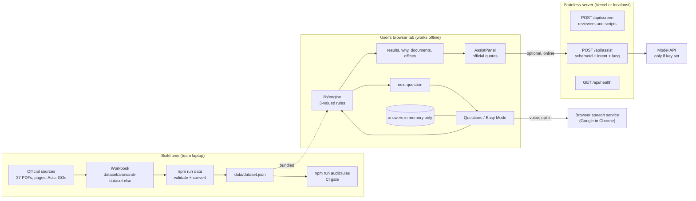
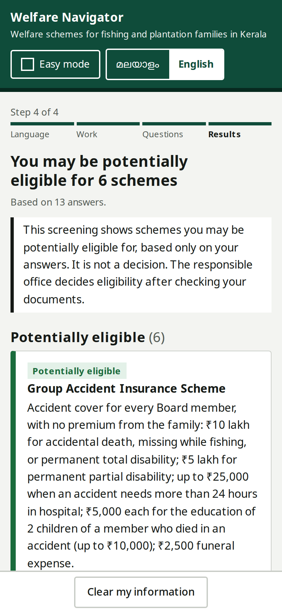
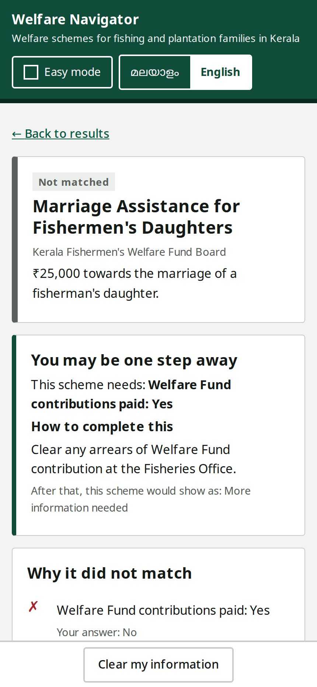

# Welfare Navigator

**ANAVANDI FutureBuild 2026 · Problem Statement 07**

Welfare Navigator is a bilingual Malayalam–English service that helps fishing and plantation families in Kerala discover government welfare schemes relevant to their circumstances.

The application asks only questions that can change a screening result, explains why each scheme matches or does not match, lists published document requirements, and identifies the appropriate application office across Kerala’s 14 districts.

> Welfare Navigator provides an initial screening, not a final government eligibility decision.

## Why it matters

Welfare information is often distributed across multiple government pages, forms, and offices. It can be difficult to interpret, especially for users who prefer Malayalam. Welfare Navigator brings this information into one guided flow while keeping the result transparent and privacy-conscious.

## Highlights

- Malayalam and English user experience
- Deterministic, explainable eligibility screening
- Adaptive questions that avoid unnecessary data collection
- Privacy-preserving income ranges instead of exact income values
- Condition-by-condition explanations and missing-information states
- Published documents and application routes for each scheme
- Office finder that routes by office type and printed jurisdiction across Kerala
- Easy Mode: one question per screen, large buttons, questions and answers read aloud with the spoken option highlighted
- Consolidated document checklist that prints or saves as PDF without any personal data
- Recorded Malayalam and English audio clips, with the browser voice as a fallback
- Optional voice-assisted input
- Keyboard, screen-reader, high-contrast, and reduced-motion support
- Browser-based screening with no user account or persistent answer storage

## System and data flow



The eligibility engine runs in the browser, so household answers never go to our server. Scheme rules are data using `all`, `any` and `not` groups with typed conditions. Every condition evaluates to `T`, `F` or `U`; unknown information is never a rejection on its own and is reported as **Needs information**. The same answers and dataset always produce the same result.

### Storage, APIs and offline behaviour

| Part | Where it lives | Persists? | Needs internet? |
|---|---|---|---|
| Rules, documents, offices, strings | `data/dataset.json`, bundled into the page | Build artefact | No |
| Household answers | React state in the open tab | No. Cleared on Clear, tab close, or idle (10 min, 3 min in assisted mode) | No |
| Recorded audio clips | `public/audio/ml`, `public/audio/en` | Static files | No |
| Fonts | Self-hosted by `next/font` at build | Static files | No |
| `POST /api/screen` | Same engine, stateless, for reviewers and scripts | No, `no-store`, no logging | Only if called remotely |
| `POST /api/assist` | Optional plain-language rewrite | No, `no-store`, no logging | Yes, and a server key |
| `GET /api/health` | Dataset counts and build info | No | No on localhost |
| Voice input | Browser speech recognition | Not by us | Yes; hidden when offline |
| Browser storage | Not used | | |

Offline test: `npm run build && npm start`, then disconnect. Screening, both languages, tap input, recorded audio, results, checklist, office addresses, the official quotes in the helper and `/review` keep working. Voice and the AI rewrite hide themselves.

## Data

### Sources

37 sources, each with authority, title, URL or stored file, document type, language, issue date and access date. 6 are tier 1 (Act, gazette, government order, official report) and 31 tier 2 (official department or board pages). The main ones are the Kerala Fishermen's Welfare Fund Board welfare schemes guideline (2025), the Fisheries Department scheme pages and district officer list, the Kerala Small Plantation Workers' Welfare Fund Act 2008, the Small Plantation Workers' Welfare Fund Board benefit pages and forms, G.O.(P) 81/2024/LBR, Matsyafed contacts and the Akshaya centre directory. Copies of downloadable sources are in `sources/`.

### Fields

| Sheet | Key fields |
|---|---|
| `sources` | id, tier, authority, title, url, doc type, language, issued, accessed, local file |
| `facts` | id, type (boolean, enum, multi, number), question and label in EN/ML, unit, sensitivity, order |
| `options` | fact, value, EN/ML label, spoken synonyms |
| `schemes` | id, EN/ML name, authority, category, summary, verification level for eligibility / documents / apply, last verified, verified by |
| `conditions` | scheme, condition id, group (same group = OR), fact, operator, value, changeable, how-to, source id, exact quote, locator, reviewed by |
| `documents`, `scheme_documents` | document names EN/ML, issuer, optional `when` condition, source quote |
| `location_types`, `locations`, `scheme_apply` | office type, district, address, phone, jurisdiction, mode (in person / online) |
| `terminology`, `disclaimer` | approved EN/ML terms and disclaimer text |
| `profiles` | test households with expected status per scheme and expected missing facts |

Current build: 32 schemes (22 fishing, 10 plantation; 27 screenable, 5 informational), 106 conditions, 41 facts, 67 documents, 66 offices across 14 districts, 32 test profiles (18 standard, 10 boundary, 3 incomplete, 1 mixed).

### Transformations

1. Team reads each source and copies the exact sentence into the workbook with a page locator.
2. `npm run data` validates the workbook (duplicate ids, fact and operator types, source references, quotes present, documents, districts, offices, Malayalam text) and fails on errors.
3. Condition groups become `all` / `any` trees; numeric facts become answer bands cut at the rules' own thresholds, so nobody is asked an exact income or age.
4. District names are normalised to the 14 Kerala districts; offices are routed by type, district and printed jurisdiction.
5. `npm run audit:rules` cross-checks each numeric threshold and limit wording against its quote and writes `docs/rule-audit.md`.

### Limitations

- All 106 conditions await a second person's review against the source (`reviewed_by` is pending). They are sourced and quoted, but single-checked.
- Several Malayalam PDFs use legacy fonts and cannot be text-searched, so their quotes were typed by hand (`docs/sources-needed.md`).
- FISH-07 has no published application route; six verified schemes (FISH-03, 04, 05, 08, 09, PLNT-03) have no published document list and say so on screen.
- No office has verified coordinates, so distance is not shown; addresses, phone numbers and directions links are.
- Interface Malayalam strings are not yet marked native-reviewed (`docs/malayalam-review.md`).
- Rules are a snapshot as of the access dates shown; the app is not an official Government of Kerala service.

### Privacy controls

- Never asks for name, phone, Aadhaar, address, email or any free text.
- Income, age and years are asked as bands; sensitive questions are asked only when a remaining scheme depends on them and offer **Prefer not to say**.
- Answers live only in tab memory: not in the URL, not in localStorage, not on the server; cleared on Clear, close or idle.
- The document checklist prints scheme names, documents, offices and the disclaimer only, never answers.
- Location for **Find nearest centre** is used on the device and never sent or stored.
- API handlers do not log and respond with `no-store`; request sizes are capped and errors never echo submitted values.
- Voice is opt-in and every mic button says the audio goes to Google's speech service. The AI helper sends only scheme id, question type and language, and says so next to its button.

## Core user journey

1. A fisher family member opens the app, picks Malayalam and Easy Mode.
2. Chooses **Fishing** (multi-select, so a household that also does estate work can pick both).
3. Answers about 10–13 yes/no or band questions, each read aloud, each picked because it can still change a result. "I don't know" is always there.
4. Sees schemes grouped as **Potentially eligible**, **Needs information**, **One step away**, **Did not match**, each with the approved disclaimer.
5. Opens a scheme: every condition shows their answer, the rule and the official quote with page number.
6. Gets one merged document checklist and the right office for their district, prints it without any answers, and presses **Clear my information**.



### Edge case: contributions in arrears

A Welfare Fund Board member whose contributions are not fully paid answers **No** to "contributions fully paid". Marriage Assistance for Fishermen's Daughters is shown as **Not matched**, not hidden, with **You may be one step away**: clear the arrears at the Fisheries Office. The engine re-evaluates with that one changeable condition flipped and shows the status it would reach, here **Needs information**, because the income condition is still unanswered. Nothing is promised.



### Failure case: no internet or no speech service

Voice buttons check for a network and a supported browser; if either is missing the button is replaced with "Voice answers are not available here… You can tap your answer". After two failed matches on one question voice stops and asks for a tap. The AI rewrite button is simply not shown offline; the official quotes still are.

## Technology

- Next.js 16 and React 19
- TypeScript
- Zod for API input validation
- Vitest for automated tests
- ExcelJS and TSX for dataset tooling
- JSON dataset generated from the reviewed workbook

## Getting started

### Requirements

- Node.js
- npm

### Install and run

Optional environment for the AI helper: `ANTHROPIC_API_KEY`, `WN_ASSIST_MODEL` (default `claude-opus-5-5`), `WN_ASSIST=off`.

```bash
npm install
npm run data
npm test
npm run dev
```

Open [http://localhost:3000](http://localhost:3000). The reviewer dashboard is available at `/review`.

For a production build:

```bash
npm run build
npm start
```

## Available commands

| Command | Purpose |
| --- | --- |
| `npm run dev` | Start the development server |
| `npm run build` | Create a production build |
| `npm start` | Start the production server |
| `npm test` | Run the full Vitest suite |
| `npm run typecheck` | TypeScript check |
| `npm run audit:rules` | Check every rule against its quote and write `docs/rule-audit.md` |
| `npm run audit:rules:ai` | Same, plus an advisory AI second opinion (needs `ANTHROPIC_API_KEY`) |
| `npm run data` | Validate the workbook and generate `data/dataset.json` |
| `npm run data:examples` | Generate data including example rows |
| `npm run data:fixture` | Build fixture data for development and tests |
| `npm run i18n:review` | Regenerate the Malayalam review list |
| `npm run audio` | Write the Malayalam and English clip lists and index recorded audio |
| `npm run tts` | Generate missing Malayalam clips with ElevenLabs (`-- --lang en` for English) |

## Data and source governance

The source workbook is maintained at `dataset/anavandi-dataset.xlsx`. `npm run data` validates it before generating `data/dataset.json`. Validation checks duplicate identifiers, fact and operator types, source URLs, exact quotations, scheme conditions, document references, districts, application locations, and required Malayalam text.

Every verified eligibility condition is expected to include an official source, quotation, and locator. Information that cannot yet be verified is labelled as partial or informational rather than presented as a confirmed rule. Current dataset notes are available through `/review`, `docs/sources-needed.md`, and `docs/malayalam-review.md`.

## Accessibility features

### Easy Mode

Chosen on the start screen or from the header. One question per screen, very large buttons, short on-screen text, **Back / Listen again / Continue**, and "I don't know" wherever it is a valid answer. It is a presentation layer only: the same engine picks every question and receives the same answers. The test suite and `/review` check that every sample household gets the same result in both modes.

### Read-aloud with option highlighting

The question and each answer are separate utterances or recorded clips (`lib/a11y/read-sequence.ts`). An answer is highlighted from its own start event to its own end event, so there is no timing guesswork. **Speaking** uses a dashed outline, a speaker icon and a "Reading" label; **selected** uses a solid thick border, a check mark and a "Selected" label, so neither depends on colour. Tapping stops the speech and selects; Continue submits. Without speech, the screen says audio is unavailable and works by tap.

### Document checklist

Documents are merged across the potentially eligible schemes (`lib/checklist.ts`) and each one expands to show which schemes need it. Schemes without a published list show "Official document list not published / not verified". **Print or save as PDF** uses the browser's print dialog with a print-only sheet holding scheme names, documents, where to apply and the disclaimer, and no answers or identity data. **Clear after printing** erases the session.

### Where to apply

The office type comes from each scheme first, then the district office or the office whose printed jurisdiction covers the district (`lib/offices.ts`). Location is requested only when **Find nearest centre** is pressed and never leaves the device. No office has verified coordinates yet, so every office shows "Distance unavailable — official address provided" with Call and Directions links. Districts with no listed Matsyafed office are reported, with the nearest listed offices shown as other-district alternatives.

## Audio clips

`npm run audio` writes `docs/malayalam-audio-clips.csv` and `docs/english-audio-clips.csv` (one row per question, answer and number range the app can ask) and indexes the recorded files in `data/audio-manifest.json`. `npm run tts` generates missing clips with ElevenLabs (Eleven v3 for Malayalam). It reads `ELEVENLABS_API_KEY` and `ELEVENLABS_VOICE_ID_ML` / `ELEVENLABS_VOICE_ID_EN` from the shell only, and marks a clip stale if its text later changes. Listen to every clip before a demo.

## API

The stateless screening endpoint is `POST /api/screen`. The optional helper endpoint is `POST /api/assist` with `{"schemeId", "intent": "what|who|documents|apply", "lang": "en|ml"}`; `GET /api/assist` reports whether it is configured.

```json
{
  "answers": {
    "livelihood": "fishing"
  }
}
```

The response includes scheme statuses, condition results, missing facts, one-step-away guidance, documents, application routes, the next recommended question, and the applicable disclaimer. Requests and responses are not stored by the application, and responses use `Cache-Control: no-store`. Bodies are limited to 100 answers of up to 200 characters, and error messages name the fact but never repeat the submitted value.

## Privacy and safety

The application does not ask for a name, phone number, Aadhaar number, email address, home address, or free-form personal description.

Answers remain in browser memory only. They are not written to the URL or browser storage and are cleared when the user selects **Clear my information**, closes the tab, or remains idle. District detection happens locally in the browser and the coordinates are never stored. Voice input is optional and uses the browser provider's speech service (Chrome sends the audio to Google); this is stated next to every voice button, and tap-based input always remains available.

## Accessibility

Every question can be answered without voice input. The interface includes semantic headings, labelled controls, keyboard navigation, visible focus states, large touch targets, status announcements, Malayalam text support, read-aloud support, and reduced-motion behaviour.

## Project structure

```text
app/                 Next.js routes, pages, API endpoints, and global styles
components/          Guided navigation, Standard and Easy questions, results, details, checklist, and office finder
lib/engine/           Rule evaluation, screening, adaptive questions, and types
lib/data/             Dataset loading, validation, districts, and spreadsheet helpers
lib/i18n/             English/Malayalam strings and display helpers
lib/a11y/             Read-aloud sequencing with per-option start/end events
lib/easy/             Easy Mode options, selection reducer, and Standard/Easy equivalence driver
lib/assist/           Quote retrieval, grounding guard, model client and rule audit
lib/checklist.ts      Consolidated document checklist
lib/offices.ts        Office routing by type, district, and jurisdiction
data/                 Generated runtime dataset, audio manifest, and recorded clip texts
public/audio/         Recorded Malayalam (ml/) and English (en/) clips
dataset/              Source workbooks
docs/                 Data, source, Malayalam, rule-audit and AI notes; screenshots
scripts/              Dataset, audio, rule-audit and review tooling
.github/workflows/    CI: typecheck, tests, rule audit, build
tests/                Engine, dataset, flow, location, and wording tests
```

## Testing

The test suite covers rule evaluation, three-valued logic, threshold boundaries, dataset validation, adaptive question selection, expected household profiles, district locations, user-facing wording, Easy Mode equivalence, read-aloud highlighting, the document checklist, office routing, and the screening API, the helper's retrieval and grounding guard, and the rule audit.

```bash
npm test
```

## AI assistance

The eligibility engine contains no AI. AI is used only beside it:

- **Plain-language helper** (runtime, optional). On a scheme page the user taps one of four fixed questions. The app shows that scheme's official quotes, offline. If the server has `ANTHROPIC_API_KEY`, a button asks the model to rewrite only those quotes in simple Malayalam or English. The reply must cite a quote for every sentence and may not contain any number that is not in the quotes, or it is discarded. It is labelled machine-written and the quotes stay below it. Only scheme id, question type and language are sent.
- **Rule audit** (developer workflow). `npm run audit:rules` runs in CI; `npm run audit:rules:ai` adds an advisory model opinion on whether each quote supports its encoded condition. A person makes every workbook change.

Details: `docs/llm-rag.md`.

### AI use declaration

| Tool | Used for | Checked by |
|---|---|---|
| Claude Opus 5.5 (Anthropic) | Coding assistance, code review, test writing, README and docs drafting; optional runtime model for the plain-language helper and the rule-audit second opinion | Team review; tests; grounding guard at runtime |
| ChatGPT, GPT-6 Sol (OpenAI) | Coding assistance, drafting Malayalam and English interface text and scheme summaries, cross-checking source readings | Team review against the cited source |
| ElevenLabs Eleven v3 | Generating the recorded Malayalam and English question and answer clips | Listened to by the team |
| Browser speech recognition (Google in Chrome) | Optional voice input, matched only against the current question's options and always confirmed | User confirms every voice answer |

No AI model decides eligibility, writes rules into the dataset, or sees a household's answers. Every eligibility condition comes from a quote a team member copied from an official source.

## Feedback

Judge feedback and what we changed for each round are in [FEEDBACK.md](FEEDBACK.md).

## License and project status

This repository was developed for ANAVANDI FutureBuild 2026. Confirm the project’s licensing and deployment terms with the team before redistribution or production use.
